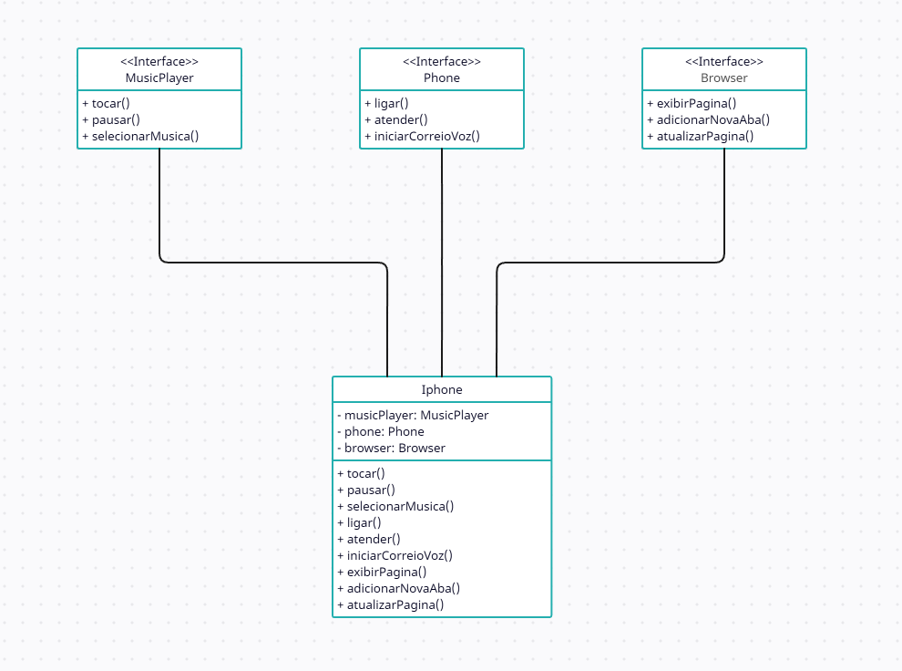

## Desafio POO - DIO
### Sobre o desafio:
Modelagem e diagramação da representação em UML e Código no que se refere ao componente iPhone.

Com base no vídeo de lançamento do iPhone conforme link abaixo, elabore em uma ferramenta de UML de sua preferência a diagramação das classes e interfaces com a proposta de representar os papéis do iPhone de: Reprodutor Musicial, Aparelho Telefônico e Navegador na Internet. Em seguida crie as classes e interfaces no formato de arquivos .java

* ``Repodutor Musicial:`` tocar, pausar, selecionarMusica
* ``Aparelho Telefônico:`` ligar, atender, iniciarCorrerioVoz
* ``Navegador na Internet:`` exibirPagina, adicionarNovaAba, atualizarPagina

## Diagramação 

O objetivo deste desafio é criar uma representação visual das classes e interfaces usando uma ferramenta de UML (Unified Modeling Language), destacando os diferentes papéis desempenhados pelo iPhone: MusicaPLayer (Reprodutor Musical), Phone (Aparelho Telefônico) e Browser (Navegador de Internet). Isso será realizado através da criação de diagramas de classes e interfaces, e a posterior implementação dessas classes e interfaces em arquivos .java, todos localizados na pasta 'src'.